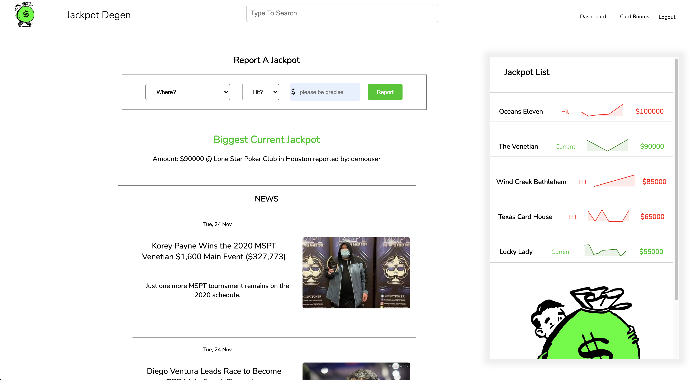
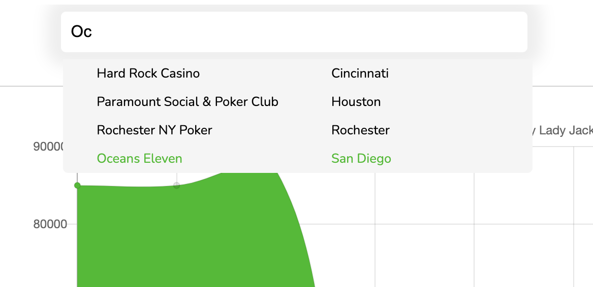
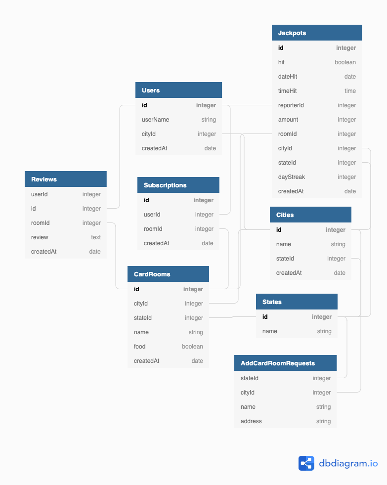
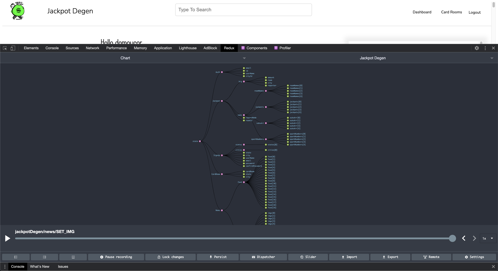
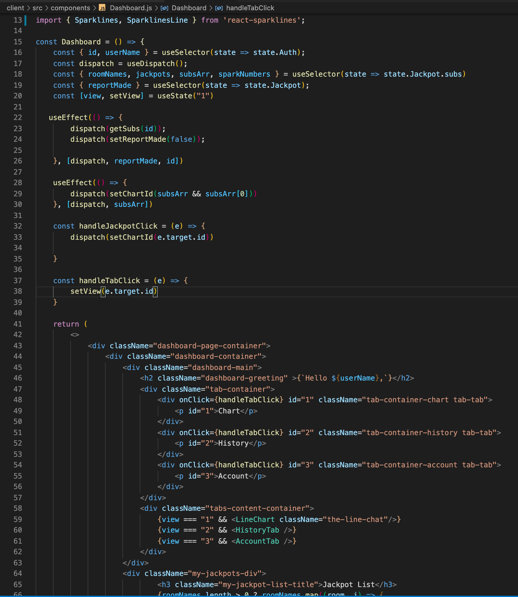
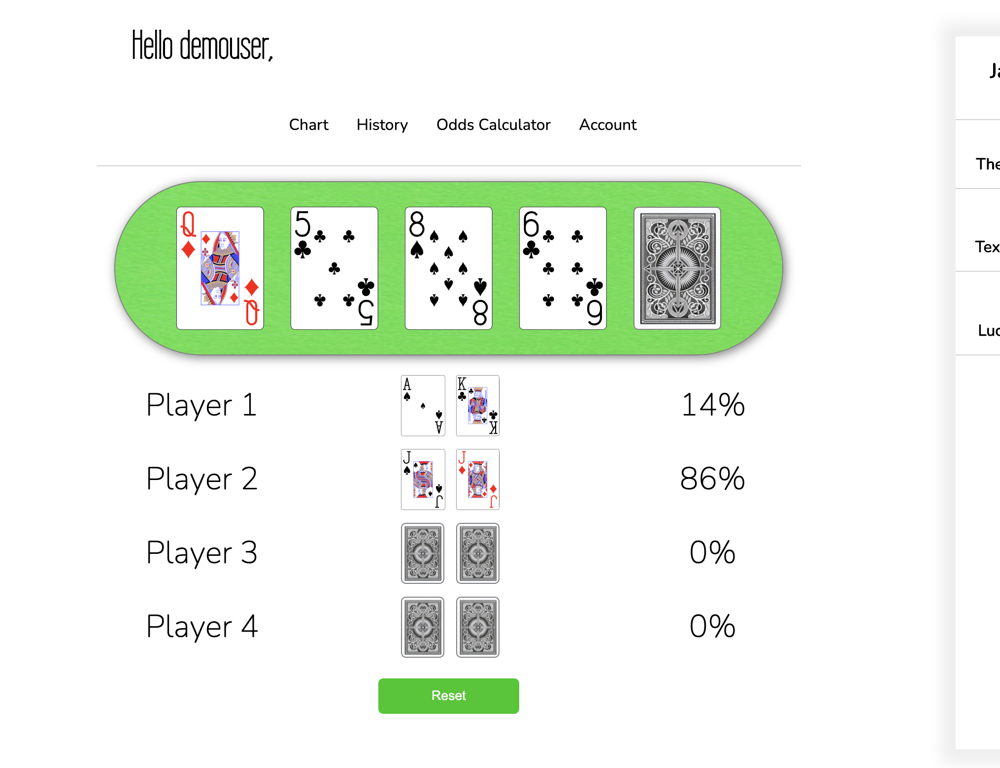
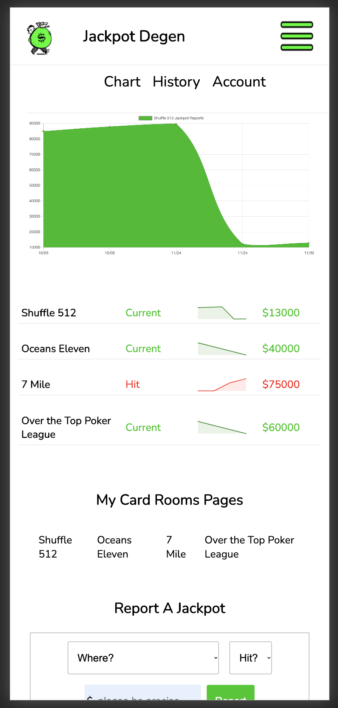

# Jackpot Degen
*By Jaron Degen - [Check out Jackpot Degen](http://jackpotdegen.com)*
- Poker Room Jackpot Tracker and Poker News

**Table of Contents**
* [Jackpot Degen Overview](#jackpot-jegen-overview)
* [Application Architecture & Technologies Used](#application-architecture) 
* [Backend Overview](#backend-overview)
* [Frontend Overview](#frontend-overview)
* [Security & Authorization](#security-&-authorization)
* [Conclusion & Future Features](#conclusion-&-future-features)

## Jackpot Degen Overview
Jackpot Degen is a full-stack web app that allows users to make an account, find and subscribe to thier favorite poker rooms around the country and, actively follow and report on current bad beat jackpots.  Users can also leave reviews for casinos and poker rooms and get access to up to date poker news via [PokerNews](https://www.pokernews.com/) RSS converted into an interactive news feed.

#### Jackpot Degen Overview

Users can also leave reviews for casinos and poker rooms and get access to up to date poker news via [PokerNews](https://www.pokernews.com/) RSS converted into an interactive news feed.

Jackpot Degen also features an suggesstive search bar built from scratch using [React](https://reactjs.org/) and using vanilla [CSS](https://developer.mozilla.org/en-US/docs/Web/CSS)

#### Application Architecture

Jackpot Degen is a full stack application and starts with the database in the backend built with [Sequelize](https://sequelize.org/master/manual/model-querying-basics.html), [Express](https://expressjs.com/), using a [PostgreSQL](https://www.postgresql.org/) database.

## Backend Overview
All data is fetched from the [Express](https://expressjs.com/) server, including queries to the database. The news comes from an RSS feed in  XML format from [pokernews.com](https://www.pokernews.com/) and then stored throughout multiple layers of the [Redux](https://redux.js.org/) store along with subscriptions, jackpots auth and other user information.  This gives users quicker load times since data is only retireved as necessary or when something in the user's dashboard changes.
Only data needed is retrieved, for example, jackpot data histories are only fetched if it is not already in the [Redux](https://redux.js.org/) store and the user is on a page requiring it, saving memory and increasing efficiency.  

## Frontend Overview

As stated before [React](https://reactjs.org/) is used and is at the core of application logic and frontend architecture.  Many built-in React 
[Hooks](https://reactjs.org/docs/hooks-intro.html) are used to aid in passing data around throughout components as well as [Redux](https://redux.js.org/) and Redux [Hooks](https://react-redux.js.org/api/hooks) and [Redux Thunk](https://www.npmjs.com/package/redux-thunk) and regular props. All of the design and animation is done with vanilla [CSS](https://developer.mozilla.org/en-US/docs/Web/CSS), [Chartjs](https://www.chartjs.org/docs/latest/) and, makes use of conditionals in [React](https://reactjs.org/) based on what the user is currently interacting with.

The most recent feature that was implemented was the 'Odds Calculator', allowing users to plug in up to 4 poker hands to see each player's chances of winning the hand, step by step.  This was done using a combination of [npm](https://www.npmjs.com/) packages that handle SVG images of the card faces and use simple logic to determine percentages based on the 52 cards in the deck [(images](https://www.npmjs.com/package/@heruka_urgyen/react-playing-cards), [logic)](https://www.npmjs.com/package/poker-odds-calculator) and a little [CSS](https://developer.mozilla.org/en-US/docs/Web/CSS) finess to create a gratifying and responsive UI.

Jackpot Degen has also been built with mobile support for devices with smaller width screens.  This was done with CSS media queries and conditional React components. 

## Security & Authorization

[Express](https://expressjs.com/), [express-validator](https://express-validator.github.io/docs/) and,[bcrypt](https://www.npmjs.com/package/bcrypt) are utilized for setting users login sessions in the backend and to handle hashed passwords. 

## Conclusion & Future Features

Jackpot Degen was my first solo full-stack project and incredibly helpful in my ongoing quest to master react and express. I have been playing poker my entire life and come from a family of poker players.  Finding the poker room with the highest current jackpot has always been a struggle and currently the only way to accomplish this, is to call each room one by one.  If you are in a unfamiliar city this is a near impossible feat. This is the reason I felt inspired to built Jackpot Degen and I hope to continue to improve this project and one day release it for scalable usage to poker players everywhere.  

 For features that I plan for the future please keep reading and check out my stretch goals.

 Thanks for checking out [Jackpot Degen!](http://jackpotdegen.com)

 Features - MVP
--------------
&check; Landing page/homepage that includes information about site and a form to signup/login. 

&check; Sign-Up form where users submit their username email, and home city, and create a password.

&check; Log-in page where users provide their email/username and password to log into the site. 

&check; Sign-out feature where session cookie is deleted and user is redirected to sign-in page. 

&check; A viewable table of current jackpots, with ability to filter by user's home city.

&check; A viewable card room details page.  

&check; A viewable dashboard of subscribed card rooms and jackpots. 

&check; Ability to subscribe and unsubscribe to card rooms. 

&check; Ability to report current Jackpots and report when a Jackpot is hit for any subscribed card rooms. 

Additional Features
-------------------
&check; Display current poker news. 

&cross; Ability to request site operator to add card rooms that are not currently listed on the app.

&cross; Google Map API showing card rooms based on location.

&cross; Suggestions based on user city and user profile. As a typical user, I want to receive suggestions of card rooms in my city. 
 
&cross; Adjust event details for local time zones. 

&check; Allow users to undo a jackpot report. 

&check; Search functionality of card rooms
